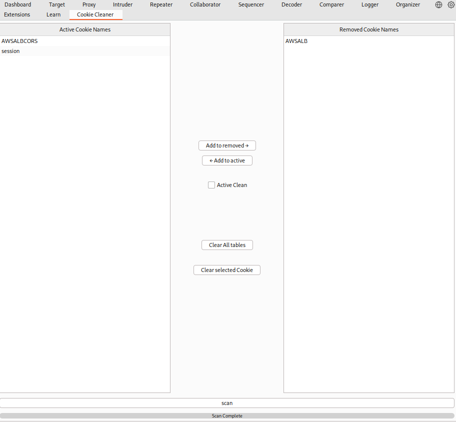

# Cookie Cleaner - Burp Suite Extension

Cookie Cleaner is a Burp Suite extension that gives you full control over which cookies are sent with your requests, allowing you to filter out noise by cleaning irrelevant cookies.

### Features
  - **Scan** — Scan your proxy history to populate the "Active Cookies" table with all in-scope cookies eligible to be filtered.
  - **Filtering** — Move cookies to the "Removed Cookies" table to filter them out of your requests automatically.
  - **Active Clean** - Toggle real time cookie filtering while proxying requests. When enabled, cookies in the Removed Cookies table are stripped from requests as they pass through the proxy.
  - **Manual Cookie Cleaning** — Right click any request in Intercept or Repeater to manually clean cookies. All cookies specified in the Removed Cookies table will be removed from the selected request.
  - **Manual Cookie Addition** —  Highlight a single cookie name in a request and use the context menu to add it directly to the Removed Cookies table without needing to scan.
  - **Multiple Cookie Addition** — Highlight multiple cookies, a full cookie name and value pair, or the entire Cookie header and use the context menu to add them all to the Removed Cookies table at once.

### Usage
  - Download the latest JAR file and add it to your Burp Suite project.

